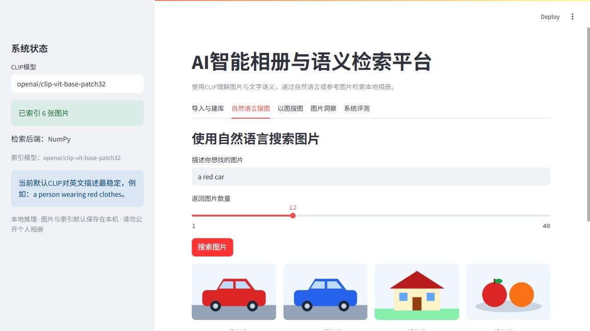
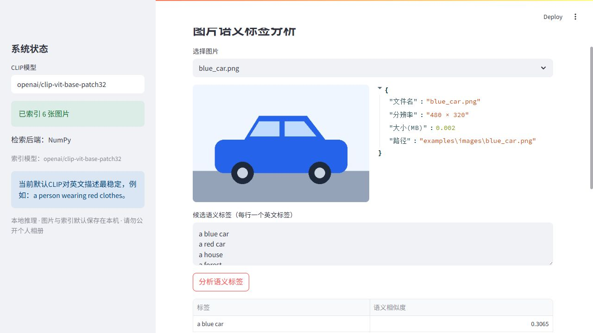

# AI Visual Search｜智能相册与多模态语义检索

面向本地图片管理的可运行应用：使用自然语言找图、上传参考图片寻找相似图片，并通过候选标签查看图片语义。基于 **CLIP、PyTorch、NumPy、Streamlit**，将图片扫描、数据校验、向量生成、索引持久化和交互式检索串成完整流程。

图片编码和检索在本机执行，不调用云端图片识别 API；公开仓库仅提供源码和原创合成演示素材，不包含个人相册。

## 已实现的功能

| 模块 | 使用方式与实现 |
| --- | --- |
| 导入与建库 | 递归扫描本地文件夹；支持 JPG、PNG、WEBP 等格式；校验损坏图片；使用 SHA-256 排除内容完全相同的文件；批量生成向量。 |
| 自然语言搜图 | 将英文描述编码为文本向量，与图片向量计算余弦相似度，返回排序后的 Top-K 图片。 |
| 以图搜图 | 上传一张参考图片，编码后检索本地索引，返回相似图片及分数。 |
| 图片洞察 | 查看分辨率、文件大小等元数据；输入候选英文标签，展示标签相似度表与条形图。 |
| 索引与模型状态 | 查看图片数量、向量维度、图片总大小和检索后端；索引保存到本地，重启后可读取。 |

默认编码器是预训练的 [`openai/clip-vit-base-patch32`](https://huggingface.co/openai/clip-vit-base-patch32)，不是在本仓库从零训练的模型。其图像与文本编码器将两种输入映射到可比较的语义空间；原始实现见 [OpenAI CLIP](https://github.com/openai/CLIP)。

## 页面预览

截图仅使用仓库内生成的六张合成插图，不包含个人照片。




## 安装与启动

已在 Windows / Python 3.13 环境验证。建议使用独立虚拟环境；首次安装 PyTorch、首次下载模型可能耗时较长。

```powershell
git clone https://github.com/DoogEgg/AI-Visual-Search.git
cd AI-Visual-Search
python -m venv .venv
.venv\Scripts\python.exe -m pip install -r requirements.txt
.venv\Scripts\python.exe run_product_app.py
```

打开 **http://127.0.0.1:8502**。也可以在 PyCharm 中选好安装依赖的解释器，运行 `run_product_app.py`。

如果端口被占用，换一个端口启动：

```powershell
.venv\Scripts\python.exe -m streamlit run product_app/app.py --server.port 8503 --server.address 127.0.0.1
```

默认使用可用的 CUDA GPU，否则使用 CPU。启动首页不会立即加载模型；第一次建库、搜索或标签分析时才加载。模型从 Hugging Face 下载后保存在本机缓存，不需要 API Key。缓存完整后可设置 `HF_HUB_OFFLINE=1` 离线使用。

## 三分钟使用教程

1. **导入与建库**：默认路径指向 `examples/images`，直接点击“开始建立索引”体验六张合成插图；也可以填入你本机的照片文件夹路径。
2. **自然语言搜图**：输入 `a red car`、`a forest` 或 `sunset over the sea`，选择返回数量后点击“搜索图片”。英文描述是当前推荐用法。
3. **以图搜图**：上传 `examples/images/red_car.png` 作为参考图片，点击“查找相似图片”。上传的参考图用于本次查询，不会自动加入相册或保存到图片库。
4. **图片洞察**：选择已索引图片，输入候选标签，例如 `a red car`、`a blue car`、`a house`，点击“分析语义标签”。
5. **重启使用**：保留本地 `product_data` 和原照片文件夹后，不必重新建库。移动/删除原照片、切换编码器，或更换电脑后，需要重新建立索引。

重要：文件夹路径指向**运行程序的电脑**，不是远端访问者的电脑。重新建库替换当前索引，不会删除原照片，也不是增量追加。

## 技术结构

```text
AI-Visual-Search/
├── run_product_app.py          # 本地启动入口，默认监听 127.0.0.1:8502
├── product_app/
│   ├── app.py                 # 五个交互模块
│   └── core/
│       ├── image_scanner.py   # 扫描、校验、元数据与 SHA-256 去重
│       ├── clip_encoder.py    # 图像/文本编码与 L2 归一化
│       ├── index_builder.py   # 分批编码与建库进度
│       ├── vector_store.py    # 持久化、模型一致性校验、Top-K 检索
│       └── config.py          # 模型、路径与支持格式
├── examples/images/           # 六张原创合成插图，无个人数据
├── scripts/                   # 演示素材生成、真实模型验证、发布检查
├── tests/                     # 核心逻辑、页面与隐私发布规则测试
├── docs/                      # 架构、隐私、评测说明和页面截图
└── requirements.txt           # 完整运行依赖
```

默认使用 NumPy 精确向量检索；若运行环境另行安装可用的 FAISS，则自动使用 `IndexFlatIP`。FAISS 不是启动应用的必需依赖，也不意味着已实现百万级检索或近似索引。更详细的实现见 [架构说明](docs/ARCHITECTURE.md)。

## 验证与指标说明

轻量测试不需要下载模型，也不需要任何真实照片：

本次本地发布检查中，25 项自动化测试通过；六张合成图的真实 CLIP 建库、索引重载与图片自身检索均通过。

```powershell
python -m pip install -r requirements-core.txt
python -m unittest discover -s tests -p "test_*.py" -v
```

安装完整依赖后，可执行真实模型端到端检查：

```powershell
python scripts/verify_model.py
# 权重已缓存时，也可离线检查：
python scripts/verify_model.py --offline
```

检查只使用六张合成插图，验证建库、保存/重载、文本检索和图片自身检索，报告写入忽略的 `tmp/` 目录。**该检查不等于真实业务检索准确率**。当前没有经标注的相册检索测试集，因此不声称“90% 准确率”、Recall@K 或 mAP 已达成。页面分数为余弦相似度，不是概率；“系统评测”页当前展示的是索引状态。详见 [验证与后续评测](docs/EVALUATION.md)。

## 隐私与使用边界

- 照片只在本机读取和编码，应用不将图片发送到云端模型 API；首次加载模型需要联网下载权重。
- 原照片不复制进仓库。索引包含原照片路径与元数据，保存在 `product_data/`，同样不得公开。
- `.gitignore` 排除照片、索引、缓存、训练权重、环境文件与密钥；提交前还需检查 Git 的实际文件清单。
- 默认仅监听本机回环地址，不提供登录、权限管理或多用户隔离；不要直接暴露到公网或共享敏感相册。
- CLIP 对中文、精细属性、计数与复杂组合条件的效果需要独立评测；本项目不是人脸身份识别系统，不用于监控或高风险自动决策。

详细说明见 [隐私与发布规范](docs/PRIVACY.md)。
